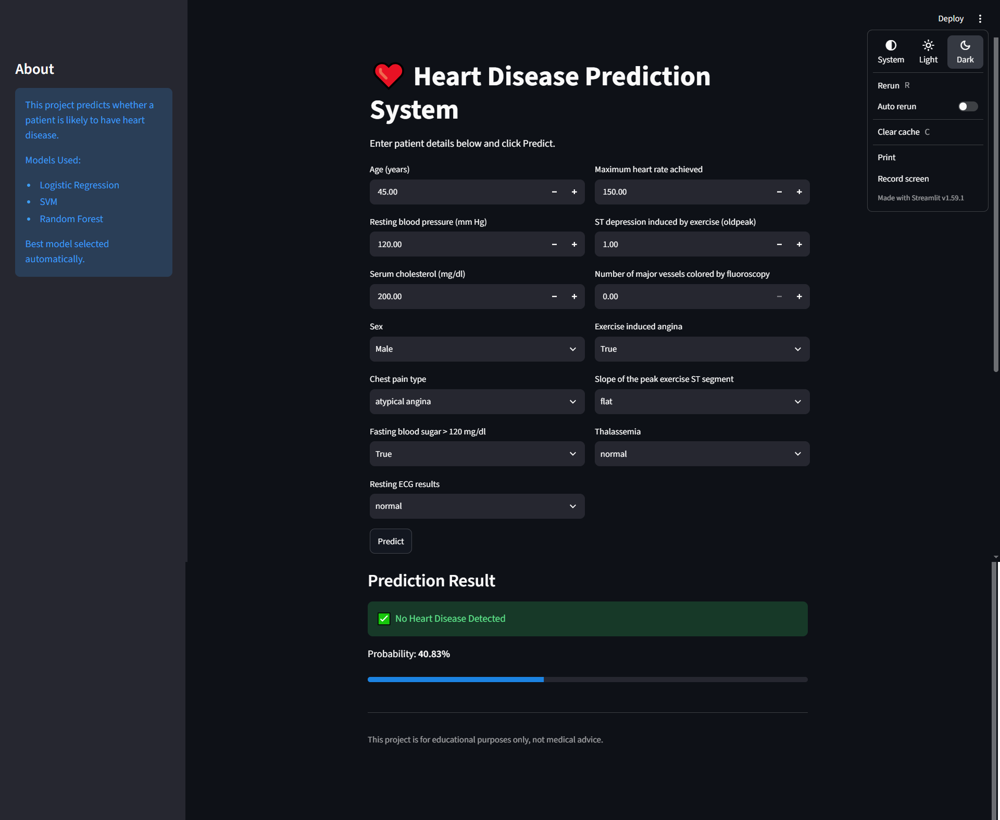
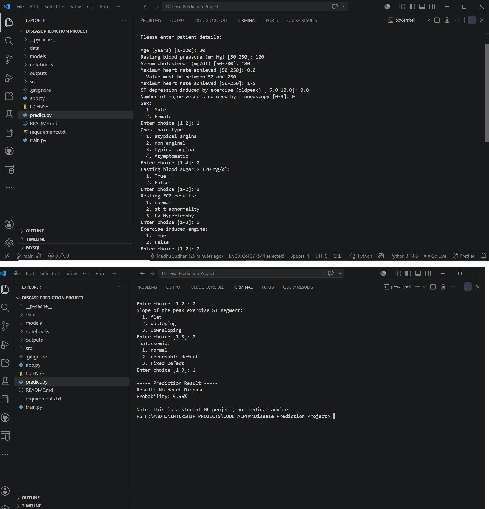

# ❤️ Disease Prediction from Medical Data


A Machine Learning project that predicts the likelihood of **Heart Disease** using patient medical attributes. The project compares multiple classification algorithms, automatically selects the best-performing model based on **ROC-AUC Score**, and provides predictions through both a **Command-Line Interface (CLI)** and a **Streamlit Web Application** — both built on a single, fully data-driven prediction pipeline.

> **Academic Project:** Developed as part of the **B.Tech Artificial Intelligence & Data Science** coursework.

---

# Table of Contents

- Overview
- Features
- Project Structure
- Dataset
- Technologies Used
- Installation
- Usage
- Models Used
- Evaluation Metrics
- Sample Results
- How Predictions Work
- Outputs
- Future Improvements
- Disclaimer
- License
- Author

---

# Overview

This project predicts whether a patient is likely to have heart disease based on medical information such as age, cholesterol level, blood pressure, chest pain type, and other clinical features.

The workflow:

1. Load the raw dataset and derive a binary target from the original multi-class label.
2. Drop non-clinical columns (`id`, the original `num` label, and `dataset` — see *Dataset* below for why `dataset` is excluded).
3. Impute missing values (median for numeric columns, mode for categorical columns).
4. One-hot encode the remaining categorical columns.
5. Split into train/test sets (stratified) and scale numeric features.
6. Train and evaluate multiple models (Logistic Regression, SVM, Random Forest, optionally XGBoost).
7. Automatically select the best model by ROC-AUC and save the model, scaler, and feature list.
8. Serve predictions through a CLI (`predict.py`) and a Streamlit app (`app.py`) that both build their inputs dynamically from the saved feature list and share the same underlying prediction logic (see *How Predictions Work*).

---

---

# Application Preview

## Home Page



## Prediction Result



---
# Features

- Data preprocessing and feature scaling
- Training multiple Machine Learning models
- Automatic best model selection by ROC-AUC
- Model evaluation using standard classification metrics
- ROC Curve, Confusion Matrix, and Feature Importance visualizations
- Model serialization using Joblib
- Fully data-driven prediction schema — CLI and web app adapt automatically to whatever features the model was actually trained on
- Terminal-based prediction (`predict.py`)
- Streamlit web application (`app.py`), sharing prediction logic with the CLI
- Input validation and graceful error handling (missing files, invalid input) in both interfaces

---

# Project Structure

```text
Disease_Prediction_Project/
│
├── data/
│   └── heart.csv                  # Real UCI/Kaggle multi-site heart disease dataset
│
├── notebooks/
│   └── eda.ipynb                  # Exploratory data analysis
│
├── src/
│   ├── make_dataset.py            # Legacy/optional synthetic-data generator (see Dataset)
│   ├── preprocessing.py           # Load, clean, encode, split, and scale the dataset
│   └── train_utils.py             # Training/evaluation/plotting helpers
│
├── models/
│   ├── best_model.pkl             # Best model selected by ROC-AUC
│   ├── scaler.pkl                 # Fitted StandardScaler
│   └── feature_names.pkl          # Trained feature schema (single source of truth
│                                   # for both predict.py and app.py)
│
├── outputs/
│   ├── model_comparison.csv       # Accuracy/Precision/Recall/F1/ROC-AUC per model
│   ├── roc_curve.png
│   ├── confusion_matrix.png
│   └── feature_importance.png
│
├── app.py                         # Streamlit web app
├── train.py                       # Training pipeline entry point
├── predict.py                     # CLI prediction entry point
├── requirements.txt
└── README.md
```

> **Note:** `src/make_dataset.py` is legacy/optional — it generates a synthetic dataset with a different, simplified schema than `data/heart.csv` (numeric codes instead of the real dataset's string categories, and no multi-site `dataset` column). It writes to `data/synthetic_heart_sample.csv`, a separate file, so running it never overwrites the real `data/heart.csv`. It is **not** part of the current training workflow and is not required to run this project; it's kept for reference only. See *Usage* below.

---

# Dataset

The project uses the **Heart Disease Dataset** (UCI Cleveland / Kaggle multi-site version — Cleveland, Hungary, Switzerland, VA Long Beach), stored at `data/heart.csv`.

### Input Features

Column names below match the raw dataset exactly, including its original spelling (`thalch`, not `thalach`). Categorical columns hold their original string values (e.g. `sex` is `"Male"`/`"Female"`, not `0`/`1`) and are one-hot encoded during preprocessing.

| Column | Type | Description |
|---|---|---|
| age | numeric | Age in years |
| sex | categorical | Male / Female |
| cp | categorical | Chest pain type |
| trestbps | numeric | Resting blood pressure (mm Hg) |
| chol | numeric | Serum cholesterol (mg/dl) |
| fbs | categorical | Fasting blood sugar > 120 mg/dl (True/False) |
| restecg | categorical | Resting ECG results |
| thalch | numeric | Maximum heart rate achieved |
| exang | categorical | Exercise-induced angina (True/False) |
| oldpeak | numeric | ST depression induced by exercise |
| slope | categorical | Slope of the peak exercise ST segment |
| ca | numeric | Number of major vessels colored by fluoroscopy |
| thal | categorical | Thalassemia |

**Intentionally excluded:** the raw dataset also includes an `id` column (row identifier, no predictive value) and a `dataset` column (which clinical site collected the record — Cleveland/Hungary/Switzerland/VA Long Beach). `dataset` is deliberately dropped during preprocessing: it's a data-collection artifact, not a patient attribute, and including it would leak site-specific information into the model rather than teaching it real clinical patterns.

### Target Variable

| Value | Meaning |
|------|---------|
| 0 | No Heart Disease |
| 1 | Heart Disease |

Derived from the raw dataset's original multi-class `num` column (`num == 0` → 0, `num > 0` → 1).

---

# Technologies Used

- Python
- Pandas
- NumPy
- Scikit-learn
- Matplotlib
- Seaborn
- Streamlit
- Joblib
- XGBoost (Optional)

---

# Installation

## Clone the Repository

```bash
git clone https://github.com/singhmadhusudan2003-wq/Disease-Prediction-Project.git

cd Disease-Prediction-Project

```

## Create Virtual Environment

### Windows

```bash
python -m venv venv
venv\Scripts\activate
```

### Linux / macOS

```bash
python3 -m venv venv
source venv/bin/activate
```

## Install Dependencies

```bash
pip install -r requirements.txt
```

This installs all required packages, including Streamlit. XGBoost is optional — see `requirements.txt` for how to enable it.

---

# Usage

## 1. (Optional, not required) Legacy Sample Dataset Generator

```bash
python src/make_dataset.py
```

This writes a synthetic sample dataset to `data/synthetic_heart_sample.csv` (it never touches the real `data/heart.csv`), for reference/testing only. It is **not** used by `train.py`, which trains directly on `data/heart.csv`, and its schema does not match the real dataset (see *Dataset*). Most users can skip this step entirely.

---

## 2. Train Models

```bash
python train.py
```

This step:

- Loads and preprocesses `data/heart.csv`
- Trains all available models (Logistic Regression, SVM, Random Forest, and XGBoost if installed)
- Evaluates each and skips any model that fails to train, instead of stopping the whole run
- Selects the best model by ROC-AUC
- Saves the model, scaler, and feature list to `models/`
- Automatically creates `models/` and `outputs/` if they don't already exist
- Generates the comparison table and evaluation plots in `outputs/`

---

## 3. Predict from Terminal

```bash
python predict.py
```

Prompts for patient details using menus and validated numeric ranges built dynamically from the trained model's actual feature list (`models/feature_names.pkl`), then prints the prediction and probability.

---

## 4. Run Streamlit Web App

```bash
python -m streamlit run app.py
```

Opens an interactive form in the browser, built from the same dynamic feature schema and the same prediction logic as the CLI (see *How Predictions Work*). Requires `train.py` to have been run at least once; if the model files are missing, the app shows an in-app message instead of crashing.

---

# Models Used

- Logistic Regression
- Support Vector Machine (SVM)
- Random Forest
- XGBoost *(Optional)*

The best model is selected automatically based on the highest **ROC-AUC Score**.

---

# Evaluation Metrics

The project evaluates models using:

- Accuracy
- Precision
- Recall
- F1 Score
- ROC-AUC Score
- Confusion Matrix

---

# Sample Results

Results from the current trained model, on `data/heart.csv`, after removing the `dataset` column (see *Dataset*) to eliminate data leakage:

| Model | Accuracy | Precision | Recall | F1 Score | ROC-AUC |
|------|---------:|----------:|--------:|---------:|---------:|
| SVM | 0.8533 | 0.8319 | 0.9216 | 0.8744 | 0.9192 |
| Random Forest | 0.8587 | 0.8455 | 0.9118 | 0.8774 | 0.9171 |
| Logistic Regression | 0.8424 | 0.8411 | 0.8824 | 0.8612 | 0.9032 |

> SVM is currently selected as the best model (highest ROC-AUC). Re-running `train.py` may select a different model if the data or preprocessing changes — the pipeline always picks automatically, it isn't hardcoded.

---

# How Predictions Work

Both `predict.py` (CLI) and `app.py` (Streamlit) are built around the same core principle: **the prediction schema is derived entirely from `models/feature_names.pkl` at runtime, not hardcoded.**

- `predict.py` defines `build_field_schema()`, which parses the trained feature list into numeric columns and categorical fields (with their known category values), and `predict_from_data()`, which encodes a patient record, scales it, and runs the model.
- `app.py` **imports and reuses these same functions directly** rather than reimplementing them — it only adds the Streamlit widgets around them. This guarantees the CLI and the web app can never silently drift apart or produce different predictions for the same input.
- Because the categorical field list is derived from `feature_names.pkl`, one-hot encoding drops a "baseline" category per field during training (e.g. `sex_Male` exists as a column, but there's no `sex_Female` — "Female" is the implicit baseline). A small `BASELINE_LABELS` dictionary provides a human-readable name for that baseline category **for display purposes only** in both the CLI menu and the Streamlit dropdown — it has no effect on encoding or predictions.
- Practical result: if the model is retrained with a different feature set (a new category, a renamed column, a removed field), both `predict.py` and `app.py` adapt automatically, with no code changes required in either file.

---

# Outputs

After training, the project automatically generates:

- Model Comparison Table (`outputs/model_comparison.csv`)
- ROC Curve (`outputs/roc_curve.png`)
- Confusion Matrix (`outputs/confusion_matrix.png`)
- Feature Importance Plot (`outputs/feature_importance.png`)
- Best Trained Model (`models/best_model.pkl`)
- Feature Names (`models/feature_names.pkl`)
- Scaler (`models/scaler.pkl`)

---
---

# Live Demo

The Heart Disease Prediction application is deployed using Streamlit Cloud.

🔗 Live App:
https://heart-disease-prediction-madhu.streamlit.app

---

# Future Improvements

- Hyperparameter tuning using GridSearchCV
- Cross-validation
- Explainable AI (SHAP / LIME)
- Multiple Disease Prediction
- Docker Support
- Cloud Deployment
- REST API using FastAPI or Flask
- Automated tests and CI (GitHub Actions)

---

# Disclaimer

This project is developed for **educational and research purposes only**.

The predictions generated by this model should **not** be considered professional medical advice or used for real-world clinical diagnosis.

---

# License

# License

This project is licensed under the MIT License. See the LICENSE file for details.

---

# Author

**Madhu Sudhan**

B.Tech – Artificial Intelligence & Data Science

### Skills

- Python
- Machine Learning
- Data Science
- Artificial Intelligence

### Connect

GitHub:
https://github.com/singhmadhusudan2003-wq

LinkedIn:
https://www.linkedin.com/in/madhusudhan-singh-6903a1408?utm_source=share_via&utm_content=profile&utm_medium=member_android

---

If you found this project useful, don't forget to **Star** the repository.
